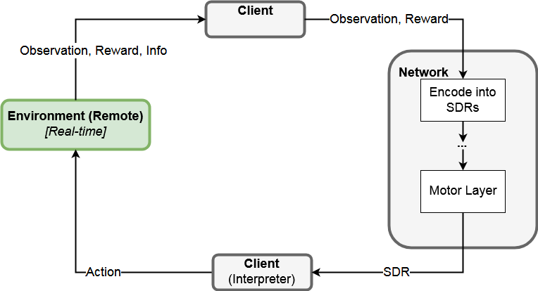
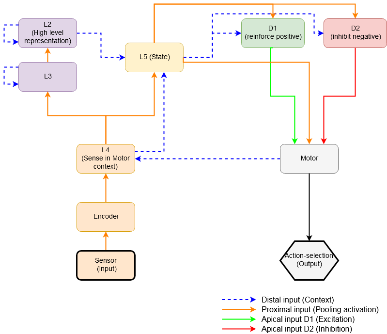
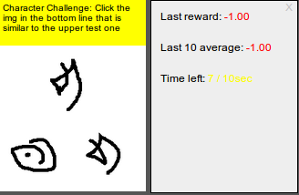
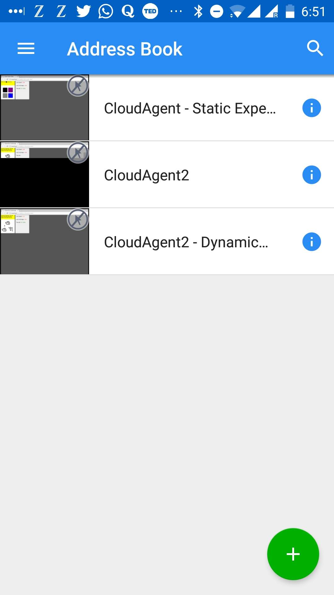

# Simple HTM & RL Software Agent Framework

This repository contains the client (agent) side of a simple framework for a reinforcement learning agent using Numentas [HTM-algorithms](https://numenta.com/resources/papers/). _(DEVELOPMENT STATUS)_

The agent architecture is based on [Ali Kaan Sungurs Master Thesis (2017)](http://etd.lib.metu.edu.tr/upload/12621275/index.pdf).
It is slightly modified and reimplemented in NUPIC, Numentas Platform for Intelligent Computing.
The implementation and experimentation was part of a [Bachelor Thesis Project](https://drive.google.com/open?id=1MTeDOLma6APog7TTKz8L-bBPkDeugf7Y), where further information can be found.

It can be build locally from source or the docker images are modified for an easy integration in some cloud infrastructure. However optimization for parallel training of agents is not yet implemented.

## Framework structure

The framework makes use of [OpenAIs Universe World of Bits environment](https://github.com/openai/universe#world_of_bits). Unfortunately this repository is deprecated now, but it is still compatible until to date.

The client and remote are both running in docker containers and the agent connects via VNC to the environment. The environment runs in real time and sends an observation and reward to the client, which in turn processes the data and sends an action. More information can be found in their [original blog post](https://blog.openai.com/universe/).

The observation and reward is processed to the base unit in NUPIC an SDR.
For this purpose a `UniverseEncoder` was implemented which applies the correct filtering on pixels and is integrated into `PluggableUniverseSensor`, a slightly modified version from Numentas `PluggableEncoderSensor`.

The Framework can either be set up from source or using existing docker images.
This makes is easy to run the agent on a local machine or migrate it into the cloud to run remotely.

### Client (Agent)

The agents architecture is further explained in the mentioned papers, here only a quick overview is given. However with NUPICs network API all layers can easily be interchanged or modified to experiment.

The layers are all defined in `network.py`, where the network is created. Each layer consists of a pooling layer and a (customized) temporal memory implementation.
A short list about the layer implementations:
- **L4** : Integrate sensations
 - `MySPRegion` : Based on NUPIC `SpatialPooler`.
 - `SensoryIntegrationRegion` : Based on HTM-Research `ExtendedTemporalMemory` with possibility to weight apical and basal connections differently. The underlying algorithm is in `regions/algorithms/apical_weighted_temporal_memory`.
- **L2/L3** : High level representations
 - `MyTemporalPoolerRegion` : Based on HTM-Research `UnionTemporalPooler` with linear decay. The underlying algorithm is in `regions/algorithms/union_temporal_pooler`.
 - `MyTMRegion` : Based on HTM-Research `ExtendedTemporalMemory` with basal and proximal connections.
- **L5** : Agent State
 - `MySPRegion` : Based on NUPIC `SpatialPooler`.
 - `AgentStateRegion` : Based on HTM-Research `ExtendedTemporalMemory` with basal, apical and proximal connections.
- **D1/D2** : Reinforcement learning
 - `MySPRegion` : Based on NUPIC `SpatialPooler`.
 - `ReinforcementRegion` : Based on HTM-Research `ExtendedTemporalMemory` with TD-Error computation and other customizations.
- **Motor** : Learn Motor mapping and produce behavior
 - `MotorRegion` : The layer is based on HTM-Research `Apical_Distal_Temporal_Memory`, which was almost completely rewritten in `regions/algorithms/apical_distal_motor_memory`. It contains the logic to calculate layer 5 voluntary active cells, excite/inhibit corresponding motor cells and map motor cells to the state activation they produced.

 Many regions are almost identical to the original regions they are based on, thus the documentation of the regions is greatly retained. The `ReinforcementRegion` and `MotorRegion` are the ones most customized. Especially the Motor layer contains a lot of crucial functionality as it calculates (1) the voluntary active cells from layer 5 and (2) the actual motor cells that are excited/inhibited and mapped with the state they produced.

#### Install (Source)
- Requirements:
 - NUPIC (1.0.5dev0, commit: fcaea0f0cf5fc74b930a45f138279c654f870a80)
 - NUPIC-Core (1.0.5dev0, commit: 94fde1f7b45fb143c5e5ffbb1e89812868328e12)
 - HTM-Research (commit: de8539e643c898666f2dbd37ec7f79abfab4506b)
 - HTM-Research-Core (commit: 8c0b19866533035662a247ec707ac66ce242b5be)
 - [Universe environment](https://github.com/kaikun213/My_Universe) (`universe` & `gym`) is installed and can be found by python.
 - The environment [docker image](https://hub.docker.com/r/kaikun213/my-world-of-bits/) (will be pulled from universe-environment if not installed) - soure code [here](https://github.com/kaikun213/My_WOB_Env)
- Clone repository & run my_neural_net/src/myExample.py

#### Install (Docker)
- Pull [Docker Image](https://hub.docker.com/r/kaikun213/my-neural-net/) and follow instructions in `DOCKER_README.md` for more help.

### Remote (Environment)

The environment is based on [OPENAIs mini-world-of-bits.](http://alpha.openai.com/miniwob/index.html)
An open-domain platform for web-agents as described in their [paper](http://proceedings.mlr.press/v70/shi17a/shi17a.pdf). It enables the agent, or experiment-observer, to connect via remote desktop control (VNC) and control the environment.

Experiments are simply written in Javascript/HTML/CSS and thus easily modified or created by any curious researcher that want to test the architecture with a new task.

Example experiments can be found in `environments/app/universe-envs/world-of-bits/static/miniwob` of the [environment repository](https://github.com/kaikun213/My_Universe). The environment repository contains more information on how to create a customized experiment. An example experiment task from the paper:

#### Install (Source)
- Clone repository and make sure python can find the correct `universe` and `gym` import to your files.

#### Install (Docker)
- Pull [Docker Image](https://hub.docker.com/r/kaikun213/my-world-of-bits/) and follow instructions in `DOCKER_README.md` for more help.

### Cloud setup

Deploy the docker images on some cloud instance (Ubuntu image tested) and run them as described in the `DOCKER_README.md` install instructions.

Example of observing the experiments remotely via VNC from the phone:

#### TODO
- **Parameterize verbosity** level of debug print-out (e.g. Indices)
- **Refractor code** and documentation (simplify some components that are based on NUPIC-components)
- **Support/Optimize _parallel training_** of multiple agents in the cloud.
- **Finish _serialization_** implementation (`SparseMatrixConnections` from NUPIC Core missing)
- Add support for **_Player guided exploring_**
- **Advance visualization** and debug tools

*The implementations might slightly vary from the current official NUPIC versions (based on NUPIC 1.0.5dev0) and used prev. versions of HTM-Research/Core repository*
